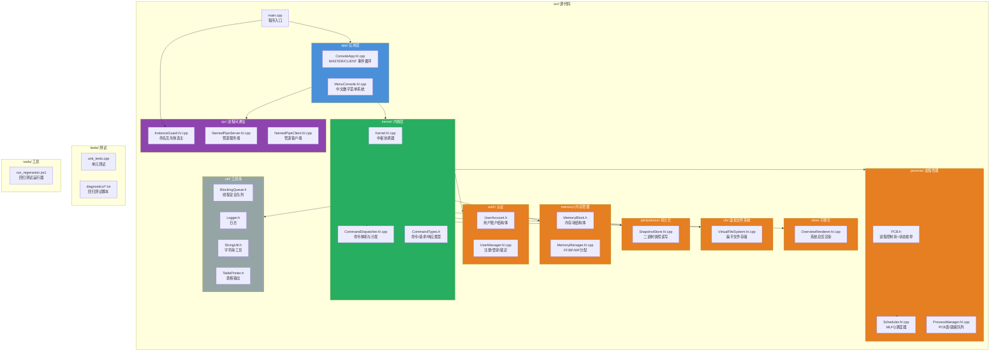
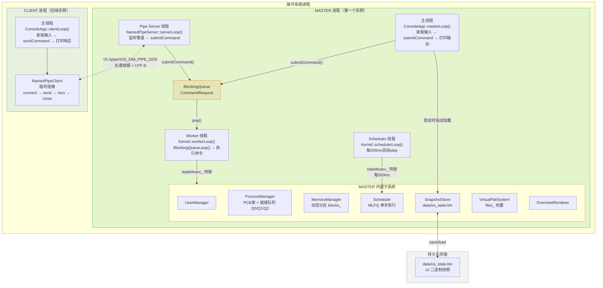
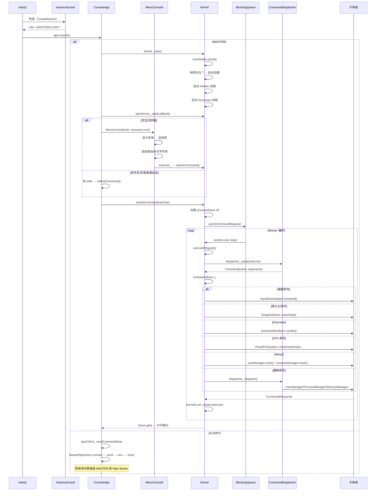
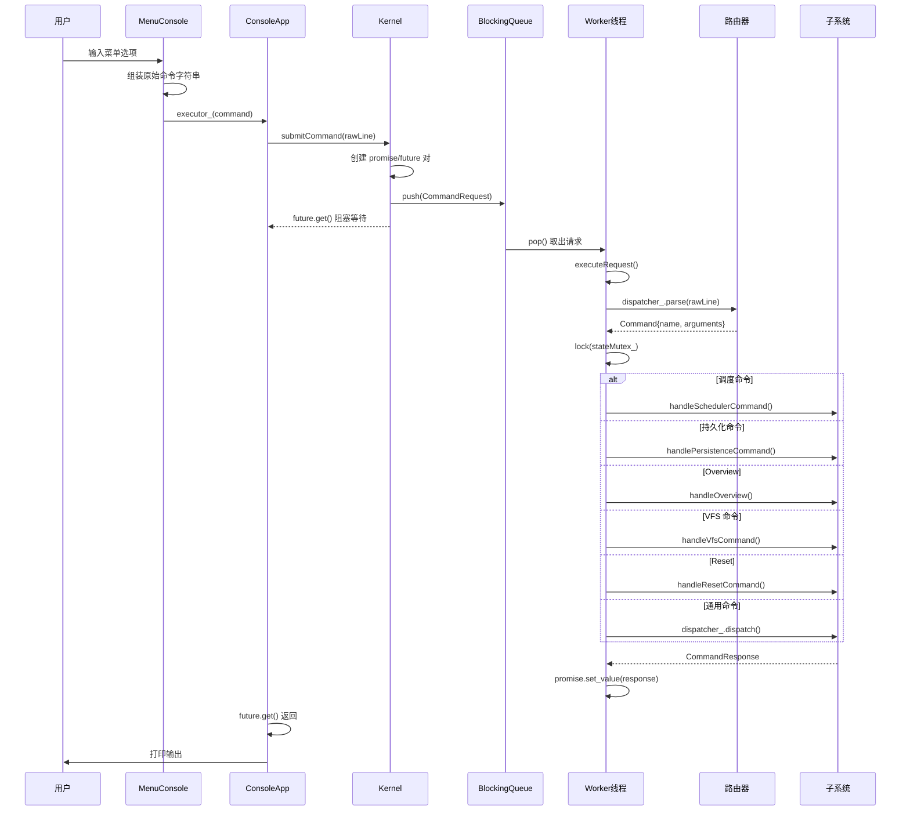
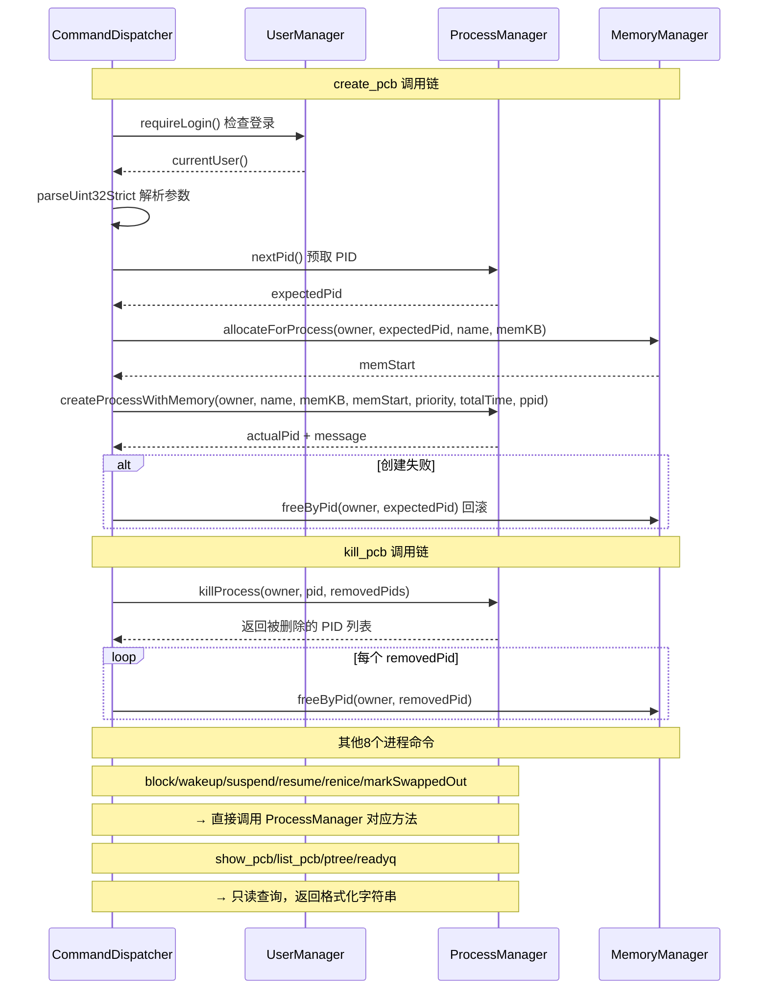
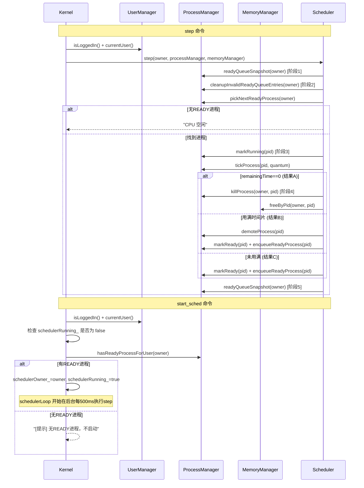
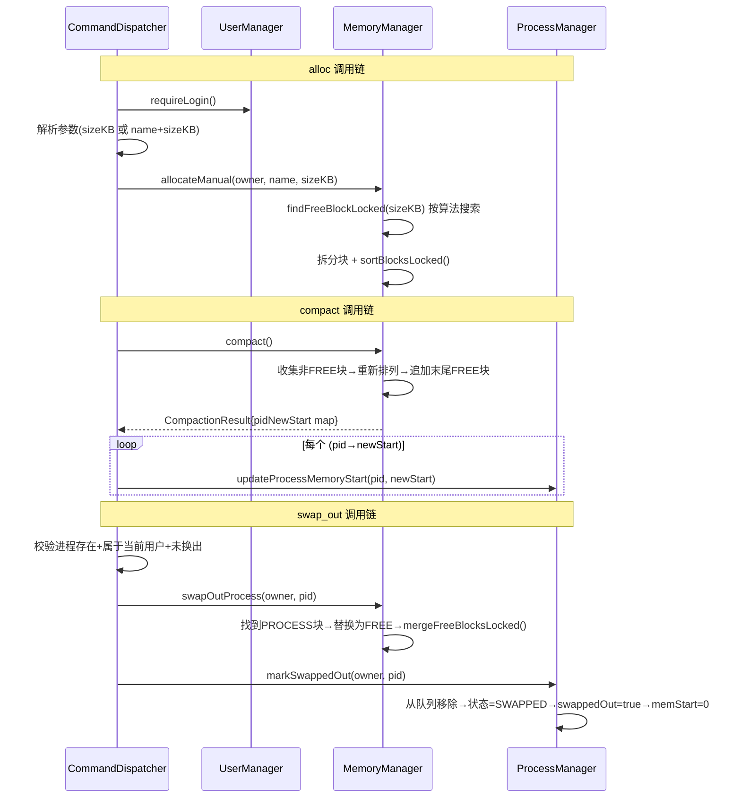
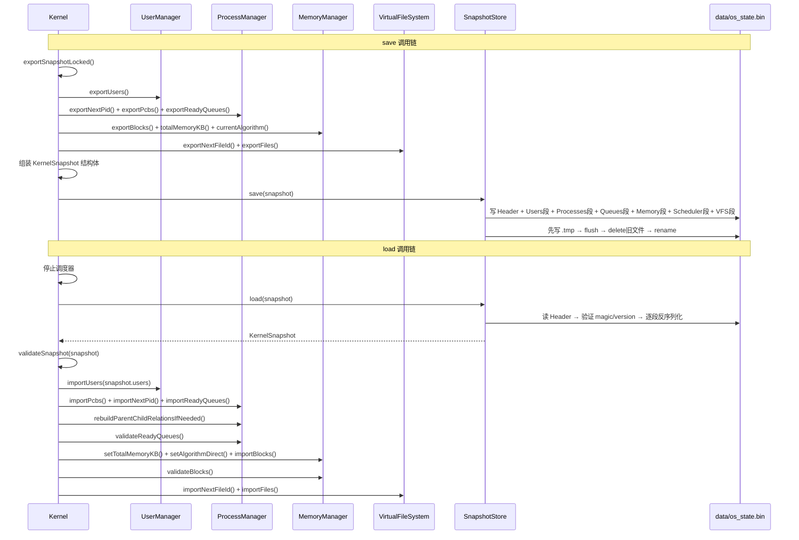
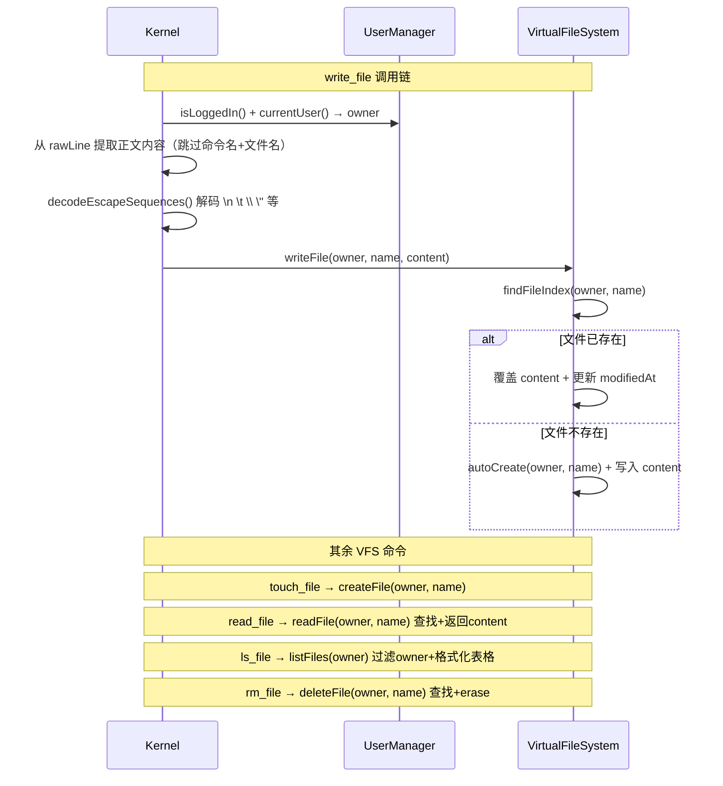

# OSCoreSim 项目架构总文档

> **可持久化操作系统核心模拟器** — 多实例 MASTER/CLIENT 架构的操作系统内核教学模拟系统

---

## 一、项目概览

### 1.1 项目简介

OSCoreSim 是一个**操作系统内核模拟器**，实现了真实操作系统中的核心子系统：

| 子系统 | 模拟内容 |
|--------|----------|
| **用户管理** | 注册/登录/登出，密码加盐哈希，三次失败锁定 |
| **进程管理** | PCB 控制块、8 状态生命周期、父子进程树、PID 复用分配 |
| **内存管理** | 动态分区分配（FF/BF/WF）、内存紧缩、换出、缺页模拟 |
| **CPU 调度** | MLFQ 三级反馈队列调度、自动/单步执行、队列降级 |
| **持久化** | 二进制快照 v2 格式，原子写入，自动加载恢复 |
| **虚拟文件系统** | 扁平文件模型，创建/读写/列表/删除，用户隔离 |
| **进程间通信** | Windows Named Pipe，MASTER/CLIENT 多实例架构 |
| **可视化** | 六段式系统总览（摘要/进程表/进程树/内存图/MLFQ/注释） |

### 1.2 技术栈

- **语言标准**: C++20
- **平台**: Windows（使用 Win32 API：Named Pipe、Named Mutex、`_isatty`）
- **依赖**: **零第三方库**，仅使用 C++ 标准库 + Windows SDK
- **构建**: Visual Studio Solution（`OSCoreSim.sln`），`x64/Release` 输出

### 1.3 编译与运行

```powershell
# 使用 MSVC 编译（VS Developer Command Prompt）
msbuild OSCoreSim.sln /p:Configuration=Release /p:Platform=x64

# 运行（第一个实例自动成为 MASTER）
.\x64\Release\OSCoreSim.exe

# 运行回归测试
powershell -File tools\run_regression.ps1
```

---

## 二、项目文件架构图



---

## 三、项目运行逻辑架构图



---

## 四、项目代码调用逻辑图



---

## 五、启动流程

### 5.1 main() 启动序列

```
main()  @ src/main.cpp
│
├─ [1] configureConsoleEncoding()
│     设置控制台 I/O 代码页为 CP_UTF8，locale 为 ".UTF-8"
│     目的：确保中文菜单和提示正常显示
│
├─ [2] InstanceGuard guard
│     CreateMutexA("Local\OS_SIM_KERNEL_MASTER_MUTEX_2026")
│     ├─ 返回 ERROR_ALREADY_EXISTS → role = CLIENT
│     └─ 否则 → role = MASTER
│
└─ [3] ConsoleApp app; app.run(guard.role())
      根据 role 进入 masterLoop() 或 clientLoop()
```

### 5.2 Kernel::start() 内部流程

```
kernel_.start()  @ Kernel.cpp
│
├─ [1] 重置请求队列和关闭标志
│     requestQueue_.reset()
│     stopping_ = false
│     shuttingDown_ = false
│     schedulerRunning_ = false
│
├─ [2] 恢复所有子系统到初始状态
│     resetStateLocked()：
│       userManager_.reset()
│       processManager_.reset()
│       memoryManager_.reset()
│       vfs_.reset()
│       scheduler_.setRunning(false)
│       schedulerOwner_.clear()
│
├─ [3] 检测快照文件
│     if (snapshotStore_.exists())
│       ├─ 加载成功 → importSnapshotLocked() 恢复全部状态
│       │             启动消息："已从快照恢复系统状态"
│       └─ 加载失败 → 以干净状态启动，不覆盖损坏的快照
│     else
│       └─ 干净启动："未发现快照文件，干净启动"
│
├─ [4] 启动 Worker 线程
│     workerThread_ = std::thread(&Kernel::workerLoop)
│
└─ [5] 启动 Scheduler 线程
      schedulerThread_ = std::thread(&Kernel::schedulerLoop)
      注意：调度器默认处于停止状态，需手动 start_sched
```

---

## 六、多实例架构（MASTER/CLIENT）

### 6.1 角色判定

通过 Windows Named Mutex 实现单例选主：

| 方面 | MASTER（第一个实例） | CLIENT（后续实例） |
|------|---------------------|---------------------|
| **检测** | `CreateMutexA` 成功 | `GetLastError() == ERROR_ALREADY_EXISTS` |
| **内核** | 持有 Kernel 实例，管理所有子系统 | 无内核，仅转发命令 |
| **IPC** | 运行 `NamedPipeServer` 线程 | 运行 `NamedPipeClient`（每次命令临时连接） |
| **管道** | `\\.\pipe\OS_SIM_PIPE_2026` | 相同管道 |
| **命令执行** | `kernel_.submitCommand()`（本地） | `pipeClient_.sendCommand()` → Master |
| **exit 行为** | 停止管道 + 停止内核 + 退出进程 | 仅关闭自身窗口 |
| **快照** | 读写 `data/os_state.bin` | 无直接文件访问 |
| **状态** | 持有持久化系统状态 | 完全无状态 |

### 6.2 Named Pipe 通信协议

```
消息格式：uint32_t 长度（小端序） + UTF-8 字节负载

Client → Server:
  uint32_t len | command_string_utf8

Server → Client:
  uint32_t len | response_string_utf8

会话生命周期：
  1. Client: WaitNamedPipeA（超时 2s）
  2. Client: CreateFileA 打开管道
  3. Client: SetNamedPipeHandleState（消息读取模式）
  4. Client: WriteFile（长度 + 命令）
  5. Server: ConnectNamedPipe（阻塞等待）
  6. Server: ReadFile（长度 + 命令）
  7. Server: handler_(command) → kernel_.submitCommand() → 获取响应
  8. Server: WriteFile（长度 + 响应）
  9. Client: ReadFile（接收响应）
  10. Client: CloseHandle
  11. Server: DisconnectNamedPipe + CloseHandle，预创建下一个实例
```

---

## 七、线程模型

### 7.1 线程总览

OSCoreSim 在 MASTER 模式下运行 **4 个线程**，CLIENT 模式下仅 **1 个线程**：

| 线程 | 来源 | 职责 |
|------|------|------|
| **主线程** | `main()` → `ConsoleApp::masterLoop()` | 读取用户输入，调用 `submitCommand()`，`future.get()` 阻塞等待结果，打印输出 |
| **Worker 线程** | `std::thread(&Kernel::workerLoop)` | 从 `BlockingQueue` 弹出命令，在 `stateMutex_` 保护下执行，通过 promise 返回结果 |
| **Scheduler 线程** | `std::thread(&Kernel::schedulerLoop)` | 每 500ms 检查 `schedulerRunning_`，为 true 时在 `stateMutex_` 下执行 `Scheduler::step()` |
| **Pipe Server 线程** | `std::thread(&NamedPipeServer::serverLoop)` | 预创建管道实例，阻塞等待 CLIENT 连接，读取命令 → 调用 handler（内部 submitCommand） → 写回响应 |

### 7.2 互斥锁层级

```
stateMutex_（主锁）
  ├── 保护：UserManager, ProcessManager, MemoryManager, VFS, Scheduler 状态
  ├── 持有者：Worker 线程（命令执行）、Scheduler 线程（自动调度）
  └── 注意：Worker 和 Scheduler 通过同一个 stateMutex_ 互斥

consoleMutex_
  └── 保护：std::cout 输出，防止调度日志与命令输出交错

子系统级互斥锁（UserManager::mutex_, ProcessManager::mutex_, MemoryManager::mutex_）
  └── 在 Kernel stateMutex_ 已持有的情况下作为额外保护层
```

### 7.3 关闭顺序

```
ConsoleApp::masterLoop() 收到 exit
  │
  ├─ pipeServer_.stop()
  │    设置停止标志 → 等待 Pipe Server 线程 join
  │
  └─ kernel_.stop()
        │
        ├─ shuttingDown_ = true
        ├─ requestQueue_.shutdown()（唤醒阻塞的 Worker 线程）
        ├─ 等待 Scheduler 线程 join
        └─ 等待 Worker 线程 join
```

---

## 八、命令处理流程

### 8.1 输入路径

```
用户输入
  │
  ├─ [交互式终端]
  │   MenuConsole::run()
  │     ├─ 显示数字菜单
  │     ├─ 读取选择 → 组装原始命令字符串
  │     └─ executor_(command) → 回调到 Kernel::submitCommand()
  │
  └─ [原始命令模式 / 非交互式]
      ConsoleApp::masterLoop() 直接读取 stdin
        └─ kernel_.submitCommand(line)
```

### 8.2 Worker 循环

```
Kernel::submitCommand(rawLine)
  │
  ├─ 创建 promise/future 对（同步等待机制）
  ├─ 创建 CommandRequest{rawLine, username, source, promise}
  ├─ requestQueue_.push(request)（唤醒 Worker 线程）
  └─ future.get()（主线程阻塞等待结果）

Kernel::workerLoop()
  │
  ├─ while (requestQueue_.pop(request))
  │     └─ executeRequest(request)
  │
  └─ executeRequest()
        │
        ├─ dispatcher_.parse(rawLine) → Command{name, arguments}
        ├─ std::lock_guard<std::mutex> lock(stateMutex_)
        ├─ 构建 CommandContext（当前用户、子系统快照引用）
        │
        ├─ 按优先级路由：
        │   ├─ 调度命令    → handleSchedulerCommand()
        │   ├─ 持久化命令  → handlePersistenceCommand()
        │   ├─ Overview    → handleOverview()
        │   ├─ VFS 命令    → handleVfsCommand()
        │   ├─ Reset       → handleResetCommand()
        │   └─ 其他        → dispatcher_.dispatch()
        │
        └─ promise.set_value(response)
```

### 8.3 路由优先级

| 优先级 | 命令组 | 处理函数 | 原因 |
|--------|--------|----------|------|
| 1 | 调度命令 | `handleSchedulerCommand()` | 需要控制 `schedulerRunning_` 标志 |
| 2 | 持久化命令 | `handlePersistenceCommand()` | 需要跨所有子系统收集状态 |
| 3 | Overview | `handleOverview()` | 需要从多个子系统读取快照 |
| 4 | VFS 命令 | `handleVfsCommand()` | 需要处理 rawLine 中的转义内容 |
| 5 | Reset | `handleResetCommand()` | 需要跨子系统清空状态 |
| 6 | 通用命令 | `dispatcher_.dispatch()` | 单子系统或系统级命令 |

---

## 九、子系统详解

### 9.1 用户管理（UserManager）

**数据模型 `UserAccount`**：

| 字段 | 类型 | 说明 |
|------|------|------|
| `username` | `string` | 1-32 字符，字母数字/下划线/连字符 |
| `passwordHash` | `string` | 16 位十六进制 FNV-1a 哈希（不存明文） |
| `salt` | `string` | 格式 `"salt_<timestamp>_<auto_id>"` |
| `failedAttempts` | `int` | 连续登录失败次数，累积 3 次锁定 |
| `status` | `AccountStatus` | `NORMAL` 或 `LOCKED` |

**哈希算法**：FNV-1a
- 偏移基数：`14695981039346656037`
- 质数：`1099511628211`
- 输入：`salt + password` 拼接字符串
- 输出：固定宽度 16 位十六进制

**登录/锁定流程**：
1. 查找用户名 → 不存在则返回"用户不存在"
2. 检查 `status == LOCKED` → 锁定则拒绝
3. 用账户存储的盐值重新计算哈希 → 比对 `passwordHash`
4. 失败：`failedAttempts++`，`>=3` 则设为 `LOCKED`
5. 成功：重置 `failedAttempts`，设置 `currentUser_`

**约束**：同时只能有一个用户登录（`currentUser_` 是单一 optional）

---

### 9.2 进程管理（ProcessManager）

**PCB 结构体（18 个字段）**：

| 字段 | 类型 | 默认值 | 说明 |
|------|------|--------|------|
| `pid` | `uint32_t` | 0 | 唯一进程标识，可回收复用 |
| `ppid` | `uint32_t` | 0 | 父进程 PID（0=根进程） |
| `name` | `string` | "" | 用户指定的进程名 |
| `owner` | `string` | "" | 所属用户名（用户隔离键） |
| `state` | `ProcessState` | `NEW` | 8 状态之一 |
| `priority` | `int` | 0 | 0-15，映射到 MLFQ 层级 |
| `queueLevel` | `int` | 0 | Q0=0(0-3), Q1=1(4-7), Q2=2(8-15) |
| `totalTime` | `uint32_t` | 0 | 总运行时间（tick） |
| `executedTime` | `uint32_t` | 0 | 已消耗 tick 数 |
| `remainingTime` | `uint32_t` | 0 | 剩余 tick = totalTime - executedTime |
| `timeSliceLeft` | `uint32_t` | 0 | 当前时间片剩余 tick |
| `memStart` | `uint32_t` | 0 | 物理内存起始地址（KB 偏移） |
| `memSize` | `uint32_t` | 0 | 物理内存分配大小（KB） |
| `swappedOut` | `bool` | false | 是否已被换出 |
| `children` | `vector<uint32_t>` | [] | 子进程 PID 列表 |

**8 种进程状态及转换**：

```
                    ┌─────────────────────────────────┐
                    │                                 │
                    v                                 │
  NEW ──→ READY ──→ RUNNING ──→ TERMINATED          │
            ↑          │                              │
            │          ├──→ BLOCKED ──→ (wakeup) ────┘
            │          │       │
            │          │       └──→ SUSPENDED_BLOCKED
            │          │               │
            │          └──→ SUSPENDED_READY
            │                        │
            └── (resume) ────────────┘

  READY/RUNNING/BLOCKED ──→ SWAPPED (换出后内存释放)
```

**PID 分配算法**：
1. 从 `nextPid_` 起向上扫描，找到第一个未被占用的 PID
2. 到达 `UINT32_MAX` 后回绕到 1 继续扫描
3. 被删除进程的 PID 空洞可被自动复用
4. PID 0 保留，表示"无父进程"

**MLFQ 就绪队列**：`array<deque<uint32_t>, 3>`

| 队列 | 优先级范围 | 时间片 |
|------|-----------|--------|
| Q0 | 0-3 | 2 tick |
| Q1 | 4-7 | 4 tick |
| Q2 | 8-15 | 8 tick |

---

### 9.3 内存管理（MemoryManager）

**内存模型**：动态分区（可变分区），默认 `totalMemoryKB_ = 1024` KB

**MemoryBlock 结构体**：

| 字段 | 类型 | 说明 |
|------|------|------|
| `start` | `uint32_t` | 起始地址（KB 偏移） |
| `size` | `uint32_t` | 块大小（KB） |
| `type` | `MemoryBlockType` | FREE / PROCESS / KERNEL / SWAPPED |
| `pid` | `uint32_t` | 所属进程 PID（FREE 为 0） |
| `owner` | `string` | 所属用户名 |
| `tag` | `string` | 标签（进程名或 "manual"） |

**三种分配算法**：

| 算法 | 简称 | 策略 | 复杂度 |
|------|------|------|--------|
| **首次适应** | FF | 返回第一个足够大的 FREE 块 | O(n)，实际最快 |
| **最佳适应** | BF | 遍历全部，选满足大小的最小块 | O(n) |
| **最差适应** | WF | 遍历全部，选满足大小的最大块 | O(n) |

**内存紧缩（Compaction）**：
- 将所有已分配块向地址 0 方向移动，消除碎片
- 返回 `CompactionResult`（`pid → newStart` 映射）
- Kernel 层遍历映射更新每个 PCB 的 `memStart`

**换出（Swap Out）**：
- 先释放进程的物理内存块（→ FREE + 合并）
- 再更新 PCB：状态 → `SWAPPED`，`swappedOut=true`，`memStart=0`
- 备注：这是模拟，无实际交换空间

---

### 9.4 调度器（Scheduler）

**MLFQ 单步调度（step）5 阶段算法**：

```
Scheduler::step(processManager, memoryManager, owner)
│
├─ [1] 调度前：记录当前就绪队列快照（日志用）
│
├─ [2] 选择进程：
│     cleanupInvalidReadyQueueEntries(owner)  // 清理脏数据
│     pickNextReadyProcess(owner)             // Q0→Q1→Q2 扫描
│
├─ [3] 执行进程：
│     markRunning(pid)                        // READY → RUNNING
│     quantum = {Q0:2, Q1:4, Q2:8}
│     tickProcess(pid, quantum)               // 至多执行 quantum 个 tick
│
├─ [4] 判断结果（三选一）：
│     ├─ A) remainingTime == 0 → 进程完成
│     │     killProcess() 递归删除子树
│     │     memoryManager.freeByPid() 释放内存
│     │
│     ├─ B) 用满时间片 → CPU 密集型
│     │     demoteProcess() 降级（Q0→Q1, Q1→Q2）
│     │     markReady() + enqueueReadyProcess()
│     │
│     └─ C) 未用满时间片 → 交互式
│           markReady() + enqueueReadyProcess()（不降级）
│
└─ [5] 调度后：记录最终队列快照
```

**自动调度**：
- `start_sched`：设置 `schedulerRunning_=true`，记录 `schedulerOwner_`
- `schedulerLoop`：每 500ms 检查 `schedulerRunning_`，为 true 时执行 `step()`
- 自动停止条件：当前用户无 READY 进程时自动停止

---

### 9.5 持久化（SnapshotStore）

**快照格式**：v2 二进制格式（非 JSON）

```
文件结构：
[Header 20B] Magic:"OSSM2026"(8B) | Version:2(4B) | HeaderSize:20(4B) | Flags:0(4B)
[Users]      count(u32) | [username | passwordHash | salt | failedAttempts | status]...
[Processes]  nextPid(u32) | count(u32) | [pid | ppid | name | owner | state | ...]...
[Queues]     Q0[count|pid...] Q1[count|pid...] Q2[count|pid...]
[Memory]     totalKB(u32) | algorithm(i32) | count | [start|size|type|pid|owner|tag]...
[Scheduler]  running(bool) | owner(string)
[VFS v2]     nextFileId(u32) | count | [fileId|owner|name|content|createdAt|modifiedAt]...
```

**关键特性**：
- 原子写入：先写 `.tmp` → 刷新 → 删除旧文件 → `rename`
- 向后兼容：v1 快照（无 VFS 段）仍可读取
- 加载时跨模块验证：用户名存在性、PCB-内存对应关系、分区连续性/无重叠

---

### 9.6 虚拟文件系统（VFS）

**文件模型**：扁平、非层次化，内存驻留

**VirtualFile 结构体**：

| 字段 | 类型 | 说明 |
|------|------|------|
| `fileId` | `uint32_t` | 全局唯一，单调递增，不回收 |
| `owner` | `string` | 所属用户（用户隔离键） |
| `name` | `string` | 文件名（同用户下唯一） |
| `content` | `string` | 文件内容（UTF-8 文本） |
| `createdAt` | `uint64_t` | 创建时间戳 |
| `modifiedAt` | `uint64_t` | 修改时间戳 |

**支持操作**：`touch_file`, `write_file`, `read_file`, `ls_file`, `rm_file`

**转义序列支持**（write_file 多行输入）：
`\n` → 换行, `\r` → 回车, `\t` → 制表符, `\\` → 反斜杠, `\"` → 双引号

---

### 9.7 可视化（OverviewRenderer）

**六段式总览输出**：

```
[1] 系统摘要  — 当前用户、进程数、内存使用率、碎片率、调度器状态、VFS 文件数
[2] 进程表    — 所有用户进程的表格（PID/名称/状态/优先级/队列/时间/内存）
[3] 进程树    — 从根进程开始的树形结构展示
[4] 内存分区图 — 1024KB 地址空间的可视化分布
[5] MLFQ 状态 — Q0/Q1/Q2 各队列中的 PID 列表
[6] Notes     — 使用提示和说明
```

---

### 9.8 应用层（ConsoleApp/MenuConsole）

**MenuConsole 菜单映射**：将中文数字菜单选择映射为原始命令字符串，通过注入的 `executor_` 回调提交到 Kernel 层。

| 主菜单 | 子菜单 | 生成的原始命令示例 |
|--------|--------|-------------------|
| 1. 用户管理 | 注册/登录/登出/查看 | `register alice pass123` |
| 2. 进程管理 | 创建/列表/详情/树/阻塞/唤醒/挂起/恢复/renice/删除/就绪队列 | `create_pcb myproc 128 5 100` |
| 3. 内存管理 | 分配/释放/分区/统计/紧缩/算法/缺页/换出 | `alloc mymem 256` |
| 4. 调度管理 | 单步/启动/停止/重启 | `step`, `start_sched` |
| 5. 持久化 | 保存/加载 | `save`, `load` |
| 6. 系统总览 | 总览/状态 | `overview`, `status` |
| 7. 虚拟文件系统 | 创建/写入/读取/列表/删除 | `touch_file test.txt` |
| 8. 原始命令模式 | — | 退出菜单，进入命令行循环 |

---

## 十、附录：完整命令参考

### 10.1 系统命令

| 命令 | 参数 | 功能 | 示例 |
|------|------|------|------|
| `help` | 无 | 显示所有可用命令列表 | `help` |
| `status` | 无 | 显示系统运行状态摘要 | `status` |
| `clear` | 无 | 清屏（输出 30 行空行） | `clear` |
| `exit` / `quit` | 无 | 退出程序（MASTER 侧关闭内核） | `exit` |
| `reset_system` | 无 | 清空所有运行时状态（含用户），**不删除快照文件** | `reset_system` |

### 10.2 用户命令

| 命令 | 参数 | 功能 | 示例 |
|------|------|------|------|
| `register` | `<username> <password>` | 注册新用户（用户名 1-32 字符，密码 1-64 字符） | `register alice mypass` |
| `login` | `<username> <password>` | 登录已有用户（同时只能一人登录） | `login alice mypass` |
| `logout` | 无 | 登出当前用户 | `logout` |
| `whoami` | 无 | 查看当前登录用户名 | `whoami` |

### 10.3 进程命令

| 命令 | 参数 | 功能 | 示例 |
|------|------|------|------|
| `create_pcb` | `<name> <memKB> <priority> <totalTime> [ppid]` | 创建进程（自动分配内存+PCB） | `create_pcb proc1 128 5 100` |
| `kill_pcb` | `<pid>` | 删除进程及其子进程树，释放内存 | `kill_pcb 3` |
| `block_pcb` | `<pid>` | 阻塞进程（READY/RUNNING→BLOCKED） | `block_pcb 3` |
| `wakeup_pcb` | `<pid>` | 唤醒进程（BLOCKED→READY） | `wakeup_pcb 3` |
| `show_pcb` | `<pid>` | 查看进程详细信息 | `show_pcb 3` |
| `list_pcb` | 无 | 列出当前用户所有进程（表格） | `list_pcb` |
| `ptree` | 无 | 显示进程树（从根进程递归展开） | `ptree` |
| `suspend` | `<pid>` | 挂起进程（READY→SUSPENDED_READY 等） | `suspend 3` |
| `resume` | `<pid>` | 恢复挂起进程 | `resume 3` |
| `renice` | `<pid> <priority>` | 修改进程优先级（0-15），影响 MLFQ 层级 | `renice 3 10` |
| `readyq` | 无 | 显示就绪队列快照（Q0/Q1/Q2 的 PID 列表） | `readyq` |

### 10.4 内存命令

| 命令 | 参数 | 功能 | 示例 |
|------|------|------|------|
| `alloc` | `<sizeKB>` 或 `<name> <sizeKB>` | 手动分配内存块（KERNEL 类型） | `alloc myblock 256` |
| `free_mem` | `<addr>` | 按起始地址释放手动内存块 | `free_mem 512` |
| `show_mem` | 无 | 显示内存分区表（所有块列表） | `show_mem` |
| `compact` | 无 | 内存紧缩（消除外部碎片） | `compact` |
| `mem_stat` | 无 | 显示内存统计（总量/已用/空闲/碎片率） | `mem_stat` |
| `set_alloc_algo` | `<FF\|BF\|WF>` | 切换内存分配算法 | `set_alloc_algo BF` |
| `pgfault` | `[pid]` | 模拟缺页中断（教育性演示，不改状态） | `pgfault 3` |
| `swap_out` | `<pid>` | 换出进程（释放物理内存，PCB 标记为 SWAPPED） | `swap_out 3` |

### 10.5 调度命令

| 命令 | 参数 | 别名 | 功能 |
|------|------|------|------|
| `step` | 无 | — | 执行一次 MLFQ 调度决策周期 |
| `start_sched` | 无 | `start` | 启动自动调度（后台每 500ms 执行 step） |
| `stop_sched` | 无 | `stop` | 停止自动调度 |
| `restart_sched` | 无 | `restart` | 重启调度器（清理无效条目后重开） |

### 10.6 持久化命令

| 命令 | 参数 | 功能 |
|------|------|------|
| `save` | 无 | 保存当前系统状态到 `data/os_state.bin`（原子写入） |
| `load` | 无 | 从 `data/os_state.bin` 加载系统状态（覆盖当前状态） |

### 10.7 VFS 命令

| 命令 | 参数 | 功能 | 示例 |
|------|------|------|------|
| `touch_file` | `<name>` | 创建空文件 | `touch_file notes.txt` |
| `write_file` | `<name> <content>` | 写入/覆盖文件内容（支持转义序列） | `write_file notes.txt Hello\nWorld` |
| `read_file` | `<name>` | 读取并显示文件内容 | `read_file notes.txt` |
| `ls_file` | 无 | 列出当前用户所有文件 | `ls_file` |
| `rm_file` | `<name>` | 删除文件 | `rm_file notes.txt` |

### 10.8 可视化命令

| 命令 | 参数 | 功能 |
|------|------|------|
| `overview` | 无 | 显示六段式系统全局总览 |

---

**命令总数**：36 个（含别名 `start`/`stop`/`restart` 及 `quit`）

---

## 十一、测试体系

### 11.1 单元测试

`tests/unit_tests.cpp` — 单文件 C++ 测试（使用 `assert()`，无测试框架），按子系统顺序测试：

1. SnapshotStore（文件路径、存在性、文件头）
2. CommandDispatcher（命令解析）
3. BlockingQueue（push/pop/shutdown）
4. UserManager（注册/重复/锁定/登录/登出）
5. ProcessManager（创建/父子/状态转换/renice/进程树/kill/PID 复用）
6. MemoryManager（分配/释放/算法切换/紧缩/换出）
7. Scheduler（step/降级/完成/内存释放）
8. Kernel 集成（完整工作流：alloc→create_pcb→show_mem→show_pcb→step→overview→VFS→save→load→自动调度）

### 11.2 回归测试

`tools/run_regression.ps1` 自动运行 10 个诊断测试脚本：

| 脚本 | 测试内容 |
|------|----------|
| `00_clean_boot_test.txt` | 干净启动验证 |
| `01_user_session_test.txt` | 用户会话管理 |
| `02_process_test.txt` | 进程命令 |
| `03_memory_test.txt` | 内存命令 |
| `04_scheduler_test.txt` | 调度器 |
| `05_persistence_test.txt` | 持久化 save/load |
| `06_vfs_test.txt` | VFS 文件操作 |
| `07_full_regression_test.txt` | 综合回归 |
| `08_vfs_unicode_multiline_test.txt` | Unicode 和多行内容 |
| `09_visualization_format_test.txt` | Overview 格式验证 |

---

> **文档版本**: 基于 OSCoreSim `No_Cmake_version` 分支代码生成，反映 2026-06-12 的代码状态。

---

## 十二、课程设计需求对照

> 本章将课程设计需求规格与代码实际实现逐项对照，标注每个需求的代码落点和实现方式。

### 12.1 用户管理模块（需求 1）

| 需求项 | 代码实现位置 | 实现方式 |
|--------|-------------|----------|
| **注册功能** | `auth/UserManager.cpp` `registerUser()` | 校验用户名格式（1-32字符）→ 检查重名 → 生成盐值 `salt_<timestamp>_<id>` → FNV-1a 哈希(salt+password) → 存入 `users_` map |
| **用户名冲突检测** | `auth/UserManager.cpp` 第 55 行 | `users_.find(username) != users_.end()` 检查是否已存在，已存在则返回 `[失败] 用户已存在` |
| **密码存储（不存明文）** | `auth/UserManager.cpp` `hashPassword()` | 仅存储 16 位十六进制 FNV-1a 散列值 + 独立盐值，磁盘快照中也不含明文 |
| **用户隔离** | `process/ProcessManager.cpp` 各操作函数 + `vfs/VirtualFileSystem.cpp` 各操作函数 | 所有 PCB 操作通过 `owner` 字段过滤（`pcb.owner == owner`），VFS 通过 `findFileIndex(owner, name)` 双键定位。不同用户不可见彼此的文件或进程 |
| **会话保持** | `auth/UserManager.cpp` `currentUser_` optional | 登录后设置 `currentUser_`，直到 `logout` 或 `exit` 才清除。`save`/`load` 手动操作后尝试保留会话（快照中存在该用户则保留） |
| **3次错误锁定** | `auth/UserManager.cpp` `login()` 第 75-85 行 | 每次登录失败 `failedAttempts++`，达到 3 次时将 `status` 设为 `LOCKED`，此后即使用正确密码也无法登录。成功登录后重置 `failedAttempts=0` |

### 12.2 进程/调度/内存命令（需求 2）

#### 12.2.1 进程类命令（10 个，需求 2.1）

| 命令 | 需求描述 | 代码实现文件:行 |
|------|---------|---------------|
| `create_pcb` | 创建进程 | `CommandDispatcher.cpp:167-231` → `ProcessManager::createProcessWithMemory()` + `MemoryManager::allocateForProcess()` |
| `kill_pcb` | 撤销进程 | `CommandDispatcher.cpp:436-450` → `ProcessManager::killProcess()` 递归删除子树 + 逐 PID 调用 `MemoryManager::freeByPid()` |
| `block_pcb` | 阻塞进程 | `CommandDispatcher.cpp:452-465` → `ProcessManager::blockProcess()` READY/RUNNING → BLOCKED |
| `wakeup_pcb` | 唤醒进程 | `CommandDispatcher.cpp:467-480` → `ProcessManager::wakeupProcess()` BLOCKED → READY |
| `show_pcb` | 查看单个PCB详情 | `CommandDispatcher.cpp:482-492` → `ProcessManager::showProcess()` |
| `list_pcb` | 列出所有进程及状态 | `CommandDispatcher.cpp:494-500` → `ProcessManager::listProcesses()` 表格输出 |
| `ptree` | 树形结构显示父子关系 | `CommandDispatcher.cpp:502-508` → `ProcessManager::processTree()` 递归展开 |
| `suspend` | 挂起进程（移出调度队列） | `CommandDispatcher.cpp:510-525` → `ProcessManager::suspendProcess()` 从就绪队列移除 |
| `resume` | 恢复挂起进程 | `CommandDispatcher.cpp:527-542` → `ProcessManager::resumeProcess()` 恢复入队 |
| `renice` | 修改进程优先级 | `CommandDispatcher.cpp:544-570` → `ProcessManager::reniceProcess()` 更新优先级+队列层级 |

**进程命令数据流**：所有进程命令共享相同的调用路径：
```
用户输入 → MenuConsole/raw → ConsoleApp → Kernel::submitCommand()
→ BlockingQueue → workerLoop → executeRequest()
→ dispatcher_.dispatch() → CommandDispatcher::dispatch()
→ 校验登录 → 校验 owner → ProcessManager 操作 → 返回 CommandResponse
```

#### 12.2.2 调度器命令（4 个，需求 2.2）

| 命令 | 需求描述 | 代码实现文件:行 |
|------|---------|---------------|
| `start_sched` | 启动后台调度线程 | `Kernel.cpp:278-291` → 设 `schedulerRunning_=true`，`schedulerLoop`（第 198 行）开始每 500ms 执行 `Scheduler::step()` |
| `stop_sched` | 暂停自动调度 | `Kernel.cpp:292-300` → 设 `schedulerRunning_=false`，线程保留等待重启 |
| `restart_sched` | 重启调度 | `Kernel.cpp:301-318` → 先停止 → `cleanupInvalidReadyQueueEntries()` → 检查队列非空 → 重启 |
| `step` | 单步执行一次调度 | `Kernel.cpp:273-277` → 直接调用 `Scheduler::step()`，不走后台循环 |

#### 12.2.3 内存类命令（8 个，需求 2.3）

| 命令 | 需求描述 | 代码实现文件:行 |
|------|---------|---------------|
| `alloc` | 手工申请内存 | `CommandDispatcher.cpp:233-290` → `MemoryManager::allocateManual()` |
| `free_mem` | 手工释放内存 | `CommandDispatcher.cpp:292-317` → `MemoryManager::freeByAddress()` |
| `show_mem` | 显示内存分区使用情况 | `CommandDispatcher.cpp:349-357` → `MemoryManager::showMemory()` 表格+分区图 |
| `compact` | 内存紧缩合并相邻空闲分区 | `CommandDispatcher.cpp:319-333` → `MemoryManager::compact()` + 遍历 `pidNewStart` 更新 PCB 的 `memStart` |
| `mem_stat` | 统计内存碎片率、空闲总量 | `CommandDispatcher.cpp:335-347` → `MemoryManager::memoryStat()` |
| `set_alloc_algo` | 切换分配算法 | `CommandDispatcher.cpp:359-367` → `MemoryManager::setAlgorithm(FF/BF/WF)` |
| `pgfault` | 模拟缺页中断 | `CommandDispatcher.cpp:369-391` → 打印模拟处理流程（保存上下文→定位页面→加载→恢复），不改变实际状态 |
| `swap_out` | 标记进程内存为换出 | `CommandDispatcher.cpp:393-400` → `MemoryManager::swapOutProcess()` 释放内存块 + `ProcessManager::markSwappedOut()` 更新 PCB |

### 12.3 状态持久化（需求 3）

| 需求项 | 代码实现位置 | 实现方式 |
|--------|-------------|----------|
| **save 命令** | `Kernel.cpp:323-332` `handlePersistenceCommand()` + `SnapshotStore::save()` | `exportSnapshotLocked()` 收集全部子系统状态 → 二进制序列化 → 先写 `.tmp` 文件 → flush → 删除旧文件 → `rename`（原子写入） |
| **load 命令** | `Kernel.cpp:334-349` `handlePersistenceCommand()` + `SnapshotStore::load()` | 停止调度器 → `SnapshotStore::load()` 读取二进制文件 → `importSnapshotLocked()` 校验跨模块一致性 → 整体替换各子系统状态 |
| **启动自动加载** | `Kernel.cpp:89-112` `start()` | `snapshotStore_.exists()` → yes: `load()` + `importSnapshotLocked()`；no: `resetStateLocked()` 干净启动 |
| **保存内容** | `Kernel.cpp:430-444` `exportSnapshotLocked()` | 用户账户、nextPid、PCB 列表、就绪队列(Q0/Q1/Q2)、内存分区表+算法、调度器运行状态、VFS(nextFileId+文件列表) |
| **快照验证** | `Kernel.cpp:489-536` `validateSnapshot()` | 用户名非空且唯一、PID 有效性、PCB-内存块一一对应、内存块无重叠/连续、parent PID 引用有效 |
| **v2 格式** | `persistence/SnapshotStore.cpp` | 文件头 Magic `"OSSM2026"` + Version=2 + HeaderSize=20；各段按固定顺序序列化，v1 兼容读取 |

### 12.4 多线程并发设计（需求 4）

| 需求项 | 代码实现 | 说明 |
|--------|---------|------|
| **前台交互线程** | `ConsoleApp::masterLoop()` 主线程 | 接收用户输入 → `submitCommand()` → `future.get()` 阻塞等待 worker 返回结果 → 打印输出 |
| **后台维护线程** | `Kernel::workerLoop()` Worker 线程 | 从 `BlockingQueue` `pop()` 命令 → `executeRequest()` → 在 `stateMutex_` 下操作所有子系统 → `promise.set_value()` 返回结果 |
| **线程同步** | `stateMutex_` (`std::mutex`) | Worker 线程和 Scheduler 线程通过同一个 `stateMutex_` 互斥，保证数据结构一致性 |
| **promise/future 同步** | `Kernel.cpp:142-160` | 主线程创建 `promise/future` 对，`push` 到队列后阻塞在 `future.get()`，worker 执行完后 `set_value()` 唤醒主线程 |
| **多实例（多窗口）** | `ipc/InstanceGuard.cpp` + `ipc/NamedPipeServer.cpp` + `ipc/NamedPipeClient.cpp` | 第一个实例通过 Named Mutex 成为 MASTER（持有内核+管道服务端），后续实例成为 CLIENT（通过管道转发命令）。**注意**：实际实现使用 Named Mutex 而非需求中提到的"文件锁或后台守护"方式——详见第十四章设计决策 |
| **单一后台线程维护状态** | MASTER 的 Worker 线程 | 所有 CLIENT 的命令通过 Named Pipe 发送到 MASTER，MASTER 的 Worker 线程统一在 `stateMutex_` 下串行执行，保证只有"一个实例的后台线程在维护物理文件内容" |
| **并发访问同一状态** | CLIENT 通过管道观察 MASTER 状态 | CLIENT 发送命令 → MASTER 执行 → 返回结果，CLIENT 始终看到 MASTER 的最新系统状态 |

### 12.5 完整可视化展示（需求 5）

| 需求项 | 代码实现 | 输出内容 |
|--------|---------|----------|
| **进程树** | `OverviewRenderer::renderProcessTree()` | 树形结构显示父子关系，每节点含：进程名、PID、状态（中文）、优先级(Prio=)、队列层级(Q)、内存占用(Mem=start+sizeKB)、换出标记 |
| **内存分区图** | `OverviewRenderer::renderMemoryMap()` | 地址范围 + 图形化进度条，已分配区域标注 `P-进程名(起始,大小)` 或 `K-标签(起始,大小)`，空闲区域标注 `Free(大小)`，末尾附块详情表格（地址/大小/类型/所有者/PID/标签） |
| **MLFQ 队列列表** | `OverviewRenderer::renderMLFQ()` | Q0/Q1/Q2 各队列显示：优先级范围、时间片大小、队内进程列表 `进程名(PID)`，空队列显示 `empty` |
| **系统摘要** | `OverviewRenderer::renderSystemSummary()` | 当前用户、进程数、总内存/已用/空闲/最大空闲块、碎片率、调度器状态、快照路径/状态、VFS 文件数 |
| **Notes** | `OverviewRenderer::renderNotes()` | 使用提示和注意事项 |

---

## 十三、命令实现详解

> 本章按子系统分组，对每条命令提供代码调用链（Mermaid 序列图）和步骤级运行逻辑说明。
> 每组选取 2-3 个代表性命令做完整剖析，其余命令用文字描述与代表性命令的差异。

### 13.1 通用命令调用框架

所有命令共享统一的入口路径，区别仅在于 `executeRequest()` 中的路由分叉：



### 13.2 进程类命令（10 个）

#### 13.2.1 进程命令调用链



#### 13.2.2 `create_pcb` —— 创建进程（步骤级详解）

**命令格式**：`create_pcb <进程名> <内存KB> <优先级> <总时间> [父PID]`

**代码路径**：`CommandDispatcher.cpp:167-231`

```
[1] 参数校验
    ├─ requireLogin(UM) 检查登录状态，未登录则直接返回"[提示] 请先登录"
    ├─ arguments 数量必须为 4 或 5（5=含父PID）
    ├─ parseUint32Strict 解析 memKB（必须 >0）
    ├─ parseIntStrict 解析 priority（必须 0-15）
    ├─ parseUint32Strict 解析 totalTime（必须 >0）
    └─ 若 arguments.size()==5，解析 ppid（uint32_t）

[2] PID 预取
    └─ processManager.nextPid() → expectedPid
       理由：需要在分配内存前知道 PID，让 MemoryBlock.pid 与 PCB.pid 一致

[3] 内存分配（先于 PCB 创建）
    └─ memoryManager.allocateForProcess(owner, expectedPid, name, memKB, memStart)
       ├─ 在 blocks_ 中查找符合当前算法的空闲块（FF/BF/WF）
       ├─ 若块大小刚好等于 memKB → 直接标记为 PROCESS
       ├─ 若块更大 → 拆分为 PROCESS 块 + 剩余 FREE 块
       └─ 失败则返回错误，不创建 PCB（无半成品进程）

[4] PCB 创建
    └─ processManager.createProcessWithMemory(owner, name, memKB, memStart, priority, totalTime, ppid, actualPid)
       ├─ 校验：owner 非空、name 非空、memKB>0、priority 0-15、totalTime>0
       ├─ 校验父进程：若 ppid 指定，父进程必须存在且属于同一 owner
       ├─ 分配 PID：firstReusablePidLocked(1) 找到最小可用正整数 PID
       ├─ 构造 PCB：state=READY, queueLevel=queueLevelForPriority(priority), timeSliceLeft=quantumForQueue(queueLevel)
       ├─ 插入 pcbTable_[pid] = pcb
       ├─ 若 ppid>0：追加 pid 到父进程的 children 列表
       └─ enqueueReadyLocked(pid)：根据 queueLevel 入队到 Q0/Q1/Q2

[5] 失败回滚
    └─ 若步骤4失败：
       memoryManager.freeByPid(owner, expectedPid, rollbackMessage)
       防止已分配的内存泄漏
```

#### 13.2.3 `kill_pcb` —— 撤销进程（步骤级详解）

**命令格式**：`kill_pcb <pid>`

**代码路径**：`CommandDispatcher.cpp:436-450`

```
[1] 子树收集
    └─ processManager.killProcess(owner, pid, removedPids)
       ├─ 校验：进程存在且 pcb.owner == owner
       ├─ collectSubtreeLocked(pid)：先序遍历进程树，收集目标进程+所有后代 PID
       ├─ 从三级就绪队列中移除所有收集到的 PID
       ├─ 遍历整个 pcbTable_，从其他进程的 children 列表中移除已删除子树的引用
       └─ 从 pcbTable_ 中删除 PCB 记录，更新 nextPid_

[2] 内存释放
    └─ 对 removedPids 中每个 PID：
       memoryManager.freeByPid(owner, pid)
       ├─ 在 blocks_ 中找到 type=PROCESS 且 owner+pid 匹配的块
       ├─ 替换为 type=FREE（{start, size, FREE, 0, "", ""}）
       └─ mergeFreeBlocksLocked()：合并相邻 FREE 块

[3] 返回值
    └─ 输出被删除的进程列表和内存释放信息
```

#### 13.2.4 其余进程命令运行逻辑

**`block_pcb <pid>`**：`ProcessManager::blockProcess()` — 校验 owner → 检查状态为 READY 或 RUNNING → 从就绪队列移除 → 状态设为 BLOCKED

**`wakeup_pcb <pid>`**：`ProcessManager::wakeupProcess()` — 校验 owner → 检查状态为 BLOCKED → 状态设为 READY → `enqueueReadyLocked()` 入队

**`suspend <pid>`**：`ProcessManager::suspendProcess()` — 校验 owner → 若 READY/RUNNING → 从队列移除 → `SUSPENDED_READY`；若 BLOCKED → `SUSPENDED_BLOCKED`

**`resume <pid>`**：`ProcessManager::resumeProcess()` — 校验 owner → 若 `SUSPENDED_READY` → READY + 入队；若 `SUSPENDED_BLOCKED` → BLOCKED（不入队）

**`renice <pid> <priority>`**：`ProcessManager::reniceProcess()` — 校验 owner → 更新 priority + queueLevel → 重置 timeSliceLeft → 若为 READY 则从旧队列移到新队列

**`show_pcb <pid>`**：只读，返回 PCB 详情字符串（所有字段），owner 不匹配则返回"访问被拒绝"

**`list_pcb`**：只读，遍历 pcbTable_，过滤 `owner == currentUser`，格式化为表格输出

**`ptree`**：只读，从根进程（ppid=0）开始递归展开，过滤 `owner == currentUser`，`renderProcessTree()` 输出树形结构

**`readyq`**：只读，`readyQueueSnapshot(owner)` 返回 Q0/Q1/Q2 三队列的 PID 列表快照

### 13.3 调度器命令（4 个）

#### 13.3.1 调度命令调用链



#### 13.3.2 `step` —— 单步调度（步骤级详解）

**命令格式**：`step`（无参数）

**代码路径**：`Kernel.cpp:273-277` → `Scheduler.cpp:34-193`

```
[1] 调度前
    └─ processManager.readyQueueSnapshot(owner)
       获取 Q0/Q1/Q2 三队列的当前 PID 列表快照，供日志对比

[2] 选择进程
    ├─ processManager.cleanupInvalidReadyQueueEntries(owner)
    │  清理就绪队列中状态非 READY、已换出、队列层级不一致的无效条目
    └─ processManager.pickNextReadyProcess(owner)
       按 Q0→Q1→Q2 顺序扫描，返回第一个 owner 匹配的 READY 进程 PID
       若无可调度进程 → 输出"CPU 空闲"并返回

[3] 执行 tick
    ├─ processManager.markRunning(pid)
    │  从就绪队列移除 + 状态→RUNNING + 若 timeSliceLeft==0 则重置
    ├─ quantum = quantumForQueue(queueLevel)：Q0=2, Q1=4, Q2=8
    └─ processManager.tickProcess(pid, quantum, tickLog)
       每 tick：executedTime++, remainingTime--, timeSliceLeft--
       循环在 remainingTime==0 或 timeSliceLeft==0 时提前终止

[4] 判断结果
    ├─ 结果A（remainingTime==0）：进程完成
    │  ├─ processManager.killProcess(owner, pid, removedPids) 递归删除子树
    │  └─ 逐 PID 调用 memoryManager.freeByPid(owner, pid) 释放内存
    │
    ├─ 结果B（ticksUsed >= quantum，用满时间片）：CPU 密集型
    │  ├─ processManager.demoteProcess(pid)：queueLevel++（Q0→Q1, Q1→Q2, Q2保持）
    │  ├─ processManager.markReady(pid)：状态→READY，重置时间片
    │  └─ processManager.enqueueReadyProcess(pid)：入队到新的队列层级
    │
    └─ 结果C（ticksUsed < quantum，未用满时间片）：交互型
       ├─ processManager.markReady(pid)：状态→READY，保留原队列层级
       └─ processManager.enqueueReadyProcess(pid)：重新入队（不降级）

[5] 调度后
    └─ processManager.readyQueueSnapshot(owner)
       获取调度后的队列快照，与 [1] 对比展示调度效果
```

#### 13.3.3 `start_sched` / `stop_sched` / `restart_sched` 运行逻辑

**`start_sched`**：校验登录 → 检查 `schedulerRunning_` 为 false → 检查 `hasReadyProcessForUser(owner)` → 设置 `schedulerOwner_=owner`, `schedulerRunning_=true` → `schedulerLoop`（第 198-223 行）在下一次 500ms 周期到达时开始执行 `step()`。若无 READY 进程则不启动，提示用户先创建进程。

**`stop_sched`**：检查 `schedulerRunning_` 为 true → 设置 `schedulerRunning_=false` → 输出当前就绪队列快照。`schedulerLoop` 在下次检查时发现标志为 false，不再调用 `step()`，但线程保持运行等待重启。

**`restart_sched`**：停止调度器 → `cleanupInvalidReadyQueueEntries()` 清理无效条目 → 若清理后无 READY 进程则不启动 → 否则重新设置 owner 和 running 标志启动。

**自动停止机制**：`schedulerLoop` 每次 `step()` 后检查 `hasReadyProcessForUser(owner)`，若为 false（所有进程已完成/阻塞/挂起/换出），自动设置 `schedulerRunning_=false`。

### 13.4 内存类命令（8 个）

#### 13.4.1 内存命令调用链



#### 13.4.2 `alloc` —— 手工分配内存（步骤级详解）

**命令格式**：`alloc <大小KB>` 或 `alloc <名称> <大小KB>`

**代码路径**：`CommandDispatcher.cpp:233-290`

```
[1] 参数校验
    ├─ requireLogin() 检查登录状态
    ├─ arguments.size() 为 1 或 2
    │   1个参数：alloc <sizeKB>，tag 默认 "manual"
    │   2个参数：alloc <name> <sizeKB>，tag=name
    └─ parseUint32Strict 解析 sizeKB（必须 >0）

[2] 分配执行
    └─ memoryManager.allocateManual(owner, name, sizeKB, memStart)
       ├─ 校验：owner 非空, sizeKB > 0
       ├─ findFreeBlockLocked(sizeKB)：根据当前算法搜索合适的 FREE 块
       │   FF：返回第一个 size>=sizeKB 的 FREE 块
       │   BF：遍历全部，返回满足条件的最小块
       │   WF：遍历全部，返回满足条件的最大块
       ├─ 若块大小 == sizeKB：直接标记为 KERNEL {start, size, KERNEL, 0, owner, tag}
       ├─ 若块更大：拆分为 KERNEL 块 + 剩余 FREE 块（插入 blocks_ 向量）
       └─ sortBlocksLocked()：保持 blocks_ 按 start 升序

[3] 返回
    └─ 输出分配结果：memStart + sizeKB + tag
```

#### 13.4.3 `compact` —— 内存紧缩（步骤级详解）

**命令格式**：`compact`（无参数）

**代码路径**：`CommandDispatcher.cpp:319-333`

```
[1] 紧缩执行
    └─ memoryManager.compact()
       ├─ 收集所有非 FREE 块到 allocated 向量，保持原相对顺序
       ├─ cursor=0，逐块重新定位 start=cursor，cursor+=size
       ├─ 为每个 PROCESS 块记录 {pid → newStart} 到 CompactionResult
       └─ 若 cursor < totalMemoryKB_：在末尾追加一个 FREE 块填满剩余空间

[2] PCB 同步
    └─ 对 compactionResult.pidNewStart 中每个 (pid, newStart)：
       processManager.updateProcessMemoryStart(pid, newStart)
       使 PCB.memStart 与紧缩后的新物理地址一致

[3] 输出
    └─ 展示紧缩前后的内存布局对比
```

#### 13.4.4 其余内存命令运行逻辑

**`free_mem <addr>`**：`MemoryManager::freeByAddress(owner, addr)` — 校验：块起始地址匹配、type≠FREE、type≠PROCESS（只能释放 KERNEL 块）、owner 匹配 → 替换为 FREE → `mergeFreeBlocksLocked()` 合并

**`show_mem`**：只读，遍历 `blocks_`，格式化为块列表表格 + 图形化分区展示。其他用户的块显示为 `OTHER_USER`

**`mem_stat`**：只读，计算 totalMemoryKB、usedKB、freeKB、largestFreeKB、外部碎片率 `(1 - largestFree/totalFree)*100%`

**`set_alloc_algo <FF|BF|WF>`**：`MemoryManager::setAlgorithm()` — 接受 FF/BF/WF 三种参数 → 更新 `algorithm_` 枚举值

**`pgfault [pid]`**：模拟缺页中断（教育性演示）。输出模拟步骤：保存上下文→定位缺失页面→加载页面→恢复上下文。不修改任何实际状态。可选的 pid 参数用于校验进程存在性

**`swap_out <pid>`**：先调用 `memoryManager.swapOutProcess(owner, pid)` 释放物理内存（PROCESS→FREE+合并），再调用 `processManager.markSwappedOut(owner, pid)` 更新 PCB（状态→SWAPPED, swappedOut=true, memStart=0）。注意此操作不可逆——没有 swap_in 命令

### 13.5 持久化命令（2 个）

#### 13.5.1 save/load 调用链



#### 13.5.2 `save` —— 保存系统状态（步骤级详解）

**命令格式**：`save`（无参数）

**代码路径**：`Kernel.cpp:323-332`

```
[1] 状态导出（exportSnapshotLocked，持 stateMutex_）
    ├─ userManager_.exportUsers()：所有注册用户（含锁定状态）
    ├─ processManager_.exportNextPid()：当前 PID 分配提示值
    ├─ processManager_.exportPcbs()：所有 PCB（按 PID 排序）
    ├─ processManager_.exportReadyQueues()：Q0/Q1/Q2 三队列的 PID 向量
    ├─ memoryManager_.exportBlocks()：所有内存块（按 start 排序）
    ├─ memoryManager_.totalMemoryKB() + currentAlgorithm()
    ├─ schedulerRunning_ + schedulerOwner_（调度器当前状态）
    ├─ vfs_.exportNextFileId() + exportFiles()：VFS 文件列表
    └─ 组装为 KernelSnapshot 结构体

[2] 二进制序列化（SnapshotStore::save）
    ├─ 确保 data/ 目录存在（create_directories）
    ├─ 创建临时文件 <snapshot_path>.tmp
    ├─ 写入文件头：Magic="OSSM2026"(8B) + Version=2(4B) + HeaderSize=20(4B) + Flags=0(4B)
    ├─ 按序写入各段：Users → nextPid → PCBs → ReadyQueues → Memory → Scheduler → VFS
    │   每段格式：count(u32) + 逐个元素序列化
    │   字符串：length(u32) + raw bytes
    │   整数：原生 little-endian uint32_t/int32_t/uint64_t
    └─ flush → 关闭 → 删除旧文件 → rename(.tmp → os_state.bin)

[3] 输出
    └─ 快照摘要：用户数、进程数、内存块数、快照文件路径
```

#### 13.5.3 `load` —— 加载系统状态（步骤级详解）

**命令格式**：`load`（无参数）

**代码路径**：`Kernel.cpp:334-349`

```
[1] 准备
    ├─ 停止调度器（schedulerRunning_=false，防止加载过程中调度线程访问旧状态）
    ├─ 记录当前登录用户（previousUser，用于后续尝试保留会话）

[2] 反序列化（SnapshotStore::load）
    ├─ 以二进制只读模式打开 data/os_state.bin
    ├─ 验证文件头：magic=="OSSM2026"，version∈{1,2}，headerSize==20
    └─ 按序读取各段反序列化为 KernelSnapshot

[3] 跨模块校验（validateSnapshot）
    ├─ 用户名非空且唯一
    ├─ PID 非零且唯一，owner 指向存在的用户名
    ├─ priority 0-15，queueLevel 0-2，timeSliceLeft 有效
    ├─ 父/子 PID 引用有效，无自引用
    ├─ PROCESS 块与 PCB 一一对应（start/size/owner/swappedOut 一致）
    ├─ 未换出 PCB 必须有对应 PROCESS 块
    └─ 内存块无重叠，连续（通过 MemoryManager::validateBlocks）

[4] 状态导入（importSnapshotLocked，按依赖顺序）
    ├─ 先恢复用户表（PCB/内存/VFS 都引用用户名）
    ├─ 若需保留会话且 previousUser 在快照中存在 → restoreSessionIfUserExists()
    ├─ 恢复 PCB 表 + nextPid + 就绪队列
    ├─ rebuildParentChildRelationsIfNeeded() 重建父子关系
    ├─ validateReadyQueues() 清理失效 PID
    ├─ 恢复内存容量 + 算法 + 分区表
    ├─ validateBlocks() 二次校验
    └─ 最后恢复 VFS（只依赖用户名，不参与 PCB/内存校验）

[5] 输出
    └─ 加载摘要 + 会话状态（保留或已清除，需重新登录）
```

### 13.6 VFS 命令（5 个）

#### 13.6.1 VFS 命令调用链



#### 13.6.2 `write_file` —— 写入文件（步骤级详解）

**命令格式**：`write_file <文件名> <内容>`

**代码路径**：`Kernel.cpp:394-401`

```
[1] 登录校验
    └─ userManager_.isLoggedIn() → currentUser() → owner

[2] 参数提取
    ├─ arguments.size() >= 2（文件名 + 至少部分内容）
    ├─ 文件名 = arguments[0]
    └─ 正文 = extractWriteFileContent(command)
       ├─ 从 rawLine 中定位第二个参数的起始位置
       └─ 取从该位置到行尾的全部内容（保留空格、特殊字符）
       注意：command.arguments[1] 只含第一个空格前的 token，
       所以必须用 rawLine 直接提取，否则多词内容会丢失

[3] 转义解码
    └─ decodeEscapeSequences(content)
       ├─ \n → 换行符 (0x0A)
       ├─ \r → 回车符 (0x0D)
       ├─ \t → 制表符 (0x09)
       ├─ \\ → 反斜杠
       └─ \" → 双引号
       解码后的内容存入 VirtualFile.content

[4] 文件写入
    └─ vfs_.writeFile(owner, name, content)
       ├─ isValidFileName(name)：1-128字节，无控制字符，无 /\\:*?\"<>|
       ├─ findFileIndex(owner, name)：按 owner+name 双键查找
       ├─ 若已存在：覆盖 content，更新 modifiedAt
       └─ 若不存在：autoCreate 分配新 fileId，设置 createdAt=modifiedAt=now
```

#### 13.6.3 其余 VFS 命令运行逻辑

**`touch_file <name>`**：校验登录 → `isValidFileName(name)` → `findFileIndex(owner, name)` 检查不重名 → 创建 VirtualFile{nextFileId_++, owner, name, "", now, now} → 追加到 files_

**`read_file <name>`**：校验登录 → `findFileIndex(owner, name)` → 若找到：返回格式化的元数据（文件名、ID、大小、创建/修改时间）+ 分隔线 + 内容 + 分隔线；若未找到：返回"文件不存在"

**`ls_file`**：校验登录 → 遍历 files_，过滤 `file.owner == owner` → 按 fileId 排序 → 格式化为表格（ID/名称/大小/修改时间）

**`rm_file <name>`**：校验登录 → `findFileIndex(owner, name)` → 若找到：`files_.erase(it)` 从向量中删除；若未找到：返回"文件不存在"

### 13.7 用户命令运行逻辑

**`register <username> <password>`**：
```
[1] 解析参数：username, password
[2] 校验格式：username 1-32字符(字母数字/下划线/连字符), password 1-64字符
[3] 检查冲突：users_.find(username) != end → 返回"用户已存在"
[4] 生成盐值：makeSalt() → "salt_<timestamp>_<auto_id>"
[5] 计算哈希：hashPassword(salt, password) → FNV-1a 16位十六进制
[6] 存储账户：users_[username] = {username, passwordHash, salt, 0, NORMAL}
```

**`login <username> <password>`**：
```
[1] 检查是否已登录：若 currentUser_ 已有值 → 拒绝（提示先 logout）
[2] 查找用户：users_.find(username) → 不存在则返回"用户不存在"
[3] 检查锁定：若 status==LOCKED → 返回"账户已锁定"
[4] 验证密码：重算 hashPassword(account.salt, password) 与 account.passwordHash 比对
[5a] 失败：failedAttempts++；若 >=3 → status=LOCKED
[5b] 成功：failedAttempts=0, currentUser_=username
```

**`logout`**：`currentUser_.reset()` 清除会话 → `executeRequest()` 检测到 logout → 停止自动调度器

**`whoami`**：只读，返回 `currentUser_` 的值或"未登录"

### 13.8 系统命令运行逻辑

**`help`**：`CommandDispatcher::helpText()` 生成所有注册命令的帮助文本，按子系统分组列出

**`status`**：`CommandDispatcher::statusText()` 收集：Worker 运行状态、调度器运行状态/owner/间隔、当前用户、进程数、内存使用量/算法、快照路径/自动加载状态、VFS 文件数 → 格式化输出

**`clear`**：直接输出 30 个换行符 `\n`

**`exit` / `quit`**：设 `CommandResponse.shouldExit = true` → 主循环检测到后执行 `pipeServer_.stop()` + `kernel_.stop()`

**`reset_system`**：
```
[1] 停止调度器（schedulerRunning_=false）
[2] resetStateLocked()：
    ├─ 清空用户表 + 清除会话
    ├─ 清空进程表 + nextPid=1 + 清空就绪队列
    ├─ 内存恢复：totalMemoryKB=1024, algorithm=FIRST_FIT, blocks_=[{0,1024,FREE}]
    └─ VFS 恢复：nextFileId=1, files_=[]
[3] 注意：不删除磁盘上的 data/os_state.bin
```

**`overview`**：
```
[1] 校验登录
[2] 从各子系统导出只读快照：
    ├─ processManager_.getProcessCopiesForUser(currentUser)
    ├─ processManager_.exportReadyQueues()
    ├─ memoryManager_.exportBlocks() + totalMemoryKB()
    └─ vfs_.fileCountForUser(currentUser)
[3] OverviewRenderer::render() 六段式渲染：
    [1]系统摘要 → [2]进程表 → [3]进程树 → [4]内存布局 → [5]MLFQ队列 → [6]Notes
```

---

## 十四、设计决策记录

> 本章记录项目中关键的架构选择——这些决策并非代码推导的必然结果，而是在多个可行方案中做出的权衡。了解这些决策有助于理解"为什么代码是这样"。

### 14.1 Named Mutex vs 文件锁：多实例选主方案

**问题**：课程需求规格描述为"通过文件锁或后台守护方式确保只有一个实例的后台线程在维护物理文件内容"。

**选择的方案**：Windows Named Mutex（`CreateMutexA`） + Named Pipe（`\\.\pipe\OS_SIM_PIPE_2026`）

**代码位置**：`ipc/InstanceGuard.cpp:6-37`, `ipc/NamedPipeServer.cpp`, `ipc/NamedPipeClient.cpp`

**为什么不选文件锁**：
1. **文件锁不可靠用于选主**：Windows 文件锁（`LockFileEx`）绑定到文件句柄的生命周期，进程崩溃时可能不自动释放
2. **Named Mutex 的语义更匹配**：`CreateMutexA` + `GetLastError() == ERROR_ALREADY_EXISTS` 天然表达了"谁是第一个"的语义，内核确保进程退出时自动释放
3. **需要的不只是"锁"，还需要通信通道**：需求要求 CLIENT 能"发送命令并观察结果"，Named Pipe 天然提供了双向命令/响应的通信通道，文件锁无法提供这个能力

**为什么不是"后台守护"**：
1. 守护进程模式更适合 Unix/Linux（fork+setsid），Windows 上缺乏原生的守护进程机制
2. 该项目面向课程教学，"第一个窗口就是 MASTER"的行为比隐藏的后台守护进程更直观、更易理解
3. MASTER 进程本身就是"前台守护"——它持有内核状态、启动 Worker 线程和 Pipe Server，CLIENT 通过管道间接访问

**实际效果**：多窗口同时运行时的行为——
- 窗口A 先启动 → Named Mutex 创建成功 → 成为 MASTER（持有内核+管道服务端）
- 窗口B 后启动 → Named Mutex 已存在 → 成为 CLIENT（通过管道转发命令）
- 窗口B 输入 `list_pcb` → 管道发送到窗口A的 Worker 线程 → 执行 → 管道返回结果 → 窗口B 显示
- 窗口B 输入 `exit` → 仅关闭自身，不影响窗口A

### 14.2 二进制快照 vs JSON：持久化格式选择

**问题**：系统状态需要持久化到磁盘，可选择人类可读的 JSON 或紧凑的二进制格式。

**选择的方案**：自定义 v2 二进制格式（Magic `"OSSM2026"` + 长度前缀序列化）

**代码位置**：`persistence/SnapshotStore.cpp`

**为什么选二进制而非 JSON**：
1. **精确控制**：二进制格式对整数宽度（uint32_t/int32_t/uint64_t）、字节序（little-endian）、字符串编码（UTF-8 raw bytes）有精确定义，不存在 JSON 的数字精度问题（如 PID 超过 2^53 时 JSON number 精度不足）
2. **类型安全**：枚举值序列化为 int32_t，反序列化时验证范围，JSON 的字符串枚举容易因拼写错误而失败
3. **性能**：对于教育项目的规模（几十个 PCB、几十个内存块），JSON 的性能完全足够，但二进制格式更贴近"操作系统"主题——真实 OS 的快照/休眠文件（如 Windows hiberfil.sys）也都是二进制格式
4. **向后兼容**：Version 字段 + v1 兼容读取，格式扩展不影响旧快照

**为什么没有选 SQLite**：课程需求明确要求"二进制物理文件"，SQLite 虽存储为二进制但其内部格式不可直接解析，不符合"课程设计级别"的透明度要求。

### 14.3 promise/future 同步 vs 回调：命令执行模型

**问题**：主线程提交命令后需要等待 Worker 线程执行完毕才能返回结果给用户。

**选择的方案**：`std::promise` / `std::future` 同步等待

**代码位置**：`Kernel.cpp:142-160`

**调用流程**：
```
主线程：promise = make_shared<promise<Response>>()
       future = promise->get_future()
       push(CommandRequest{.promise = promise})
       return future.get()  ← 阻塞直到 Worker 线程 set_value()

Worker：pop(request)
       response = executeRequest(request)
       if (request.promise) request.promise->set_value(response)
```

**为什么选 promise/future 而非回调**：
1. **控制流清晰**：`submitCommand()` 是同步函数（从调用者视角），调用后直接得到结果，无需管理回调状态
2. **异常安全**：若 Worker 线程执行过程中有未捕获异常，`set_exception()` 可以将异常传播到主线程的 `future.get()`
3. **RAII**：`shared_ptr<promise>` 的生命周期由 CommandRequest 管理，即使 Worker 线程先退出也能安全清理

**为什么没选简单的 mutex + condition_variable**：
promise/future 对是标准库提供的"一次性"同步原语，恰好匹配"提交一个命令，等待一个结果"的一次性语义。手动管理 mutex + CV 会引入更多状态变量（`done` 标志、`result` 存储）和错误的唤醒/丢失唤醒风险。

---

> **补充章节版本**: 基于课程设计需求规格对照 + 代码逐行分析生成。
